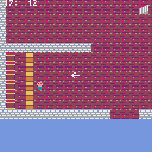
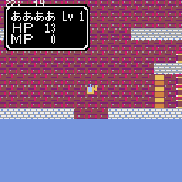
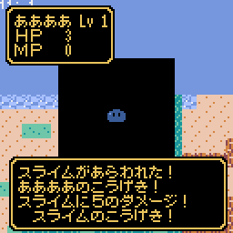
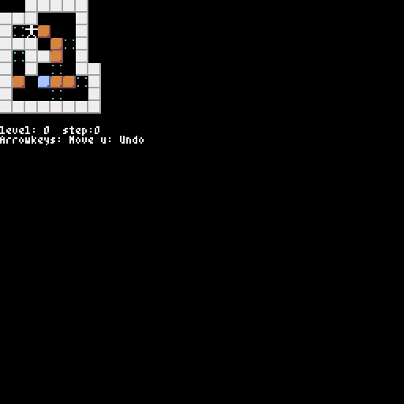
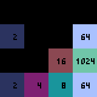
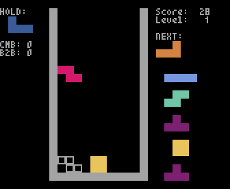
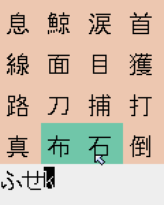
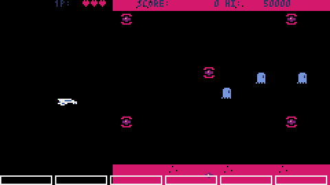

# pyxel のサンプル

## RPG

128x128 ピクセル画面のドラ ○ ンク ○ スト風システム

　　

まだ絵とか音とかストーリーとかはできていない
BDF フォント(美咲ゴシック 2nd)を使っている

- TextBox(会話)、SelectBox(コマンド)
- フィールド(街への出入り)
- NPC,ランダムウォーク
- 買い物シーン
- 戦闘シーン(画面揺れる)
- 敵の戦略

## その他

### め

### 倉庫番

ステージデータは Vim の倉庫番から

### 2048

### テトリス

自分では T-Spin とかできない

### ケシマス

Mozc のローマ字テーブルを使ってキーボードからひらがなを入力する
問題は放送から

### シューティング

## ライセンス

MIT ライセンス。
ただし、問題などのファイルは別のところから持ってきたものなので除く。
